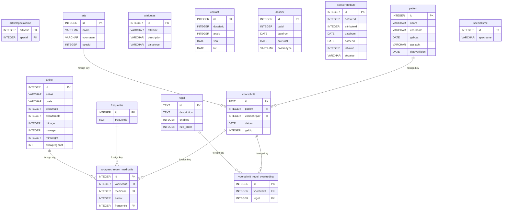

# Infra

#### Table of Contents

1. [Quickstart](#quickstart)
2. [RabbitMQ](#rabbitmq)
   1. [Exchanges / Queues](#exchanges--queues)
3. [Database](#database)
   1. [Provided Database File](#provided-database-file)
      1. [Original Entity Relationship Diagram](#original-entity-relationship-diagram)
   2. [PostgreSQL Database](#postgresql-database)
      1. [New Entity Relationship Diagram](#new-entity-relationship-diagram)

## Quickstart

Run `docker-compose up` inside the `vitaz/infra` folder.

## RabbitMQ

This project uses RabbitMQ as a message broker. By introducing a message broker, we simplify and secure the
communication between the different services and allow the project to be scaled horizontally instead of only vertically.

There are two important files in the rabbitmq/init folder:

1. definitions.json: this file preconfigures the RabbitMQ instance with two exchanges, four queues, and the bindings
   between them. It also introduces an account with read/write/configure permission.
2. rabbitmq.conf: points to the definitions.json file so RabbitMQ can use it, and disables the default guest account.

Once RabbitMQ is started, you can monitor the queues by browsing to http://localhost:15672 and logging in with credentials: guest, guest.

### Exchanges / Queues

There are two direct exchanges and four queues.
The exchanges route received messages to the correct queues by use of a routing key.

* prescriptions_exchange
    * raw_prescriptions_queue (routing key: raw)
    * accepted_prescriptions_queue (routing key: accepted)
    * rejected_prescriptions_queue (routing key: rejected)
* dead_letter_exchange
    * dead_letter_queue (routing key: dead)

To better understand the flow between the exchanges and their bound queues, refer to
the [architecture diagram](../README.md#architecture-diagram) and the README files of the various applications.

## Database

In the `infra/database` folder there is a SQLite database file `emb.db`.
This file contains dummy data about patients, doctors, medicine, etc.

We feed this file to `pgloader` to load the data (schema + records) in a PostgreSQL database.

Afterward, a set-up script adds some new tables to the database, and inserts / updates some records. Read more about this below.

### Provided Database File

The provided SQLite database file contains data for the following entities:

* artikel
* artikelspecialisme
* arts
* attributes
* contact
* dossier
* dossierattribute
* patient
* specialisme

#### Original Entity Relationship Diagram
_There are no foreign keys in the original file_

```mermaid
erDiagram

    artikel {
        INTEGER id PK
        VARCHAR artikel
        VARCHAR dosis
        INTEGER allowmale
        INTEGER allowfemale
        INTEGER minage
        INTEGER maxage
        INTEGER minweight
    }

    artikelspecialisme {
        INTEGER artikelid PK
        INTEGER specid PK
    }

    arts {
        INTEGER id PK
        VARCHAR naam
        VARCHAR voornaam
        INTEGER specid
    }

    attributes {
        INTEGER id PK
        VARCHAR attribute
        VARCHAR description
        VARCHAR valuetype
    }

    contact {
        INTEGER id PK
        INTEGER dossierid
        INTEGER artsid
        DATE van
        DATE tot
    }

    dossier {
        INTEGER id PK
        INTEGER patid
        DATE datefrom
        DATE dateuntil
        VARCHAR dossiertype
    }

    dossierattribute {
        INTEGER id PK
        INTEGER dossierid
        INTEGER attributeid
        DATE datefrom
        DATE dateend
        INTEGER intvalue
        VARCHAR strvalue
    }

    patient {
        INTEGER id PK
        VARCHAR naam
        VARCHAR voornaam
        DATE gebdat
        VARCHAR geslacht
        DATE datoverlijden
    }

    specialisme {
        INTEGER id PK
        VARCHAR specname
    }
```

### PostgreSQL Database

Using `pgloader` and a custom set-up script, we prepare a PostgreSQL database for the application to work with.
The set-up script adds the following entities to the database:

* frequentie (reference table)
* regel (reference table)
* voorgeschreven_medicatie
* voorschrift
* voorschrift_regel_overtreding

The setup script also adds a 'allowpregnant' column to the artikel entity with a default value of 0.
Afterward, for testing purposes, it randomly sets 'allowpregnant' to 1 for some records, and adds a 'weight' and 'height' dossierattribute for a specific person.
This is done because otherwise it would be impossible to have a valid prescription for any pregnant woman.

#### New Entity Relationship Diagram:

