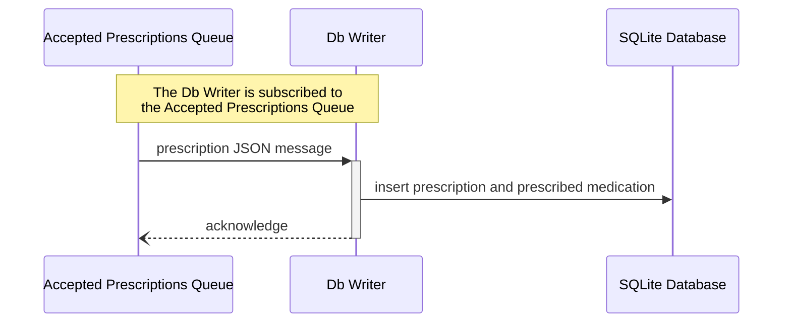
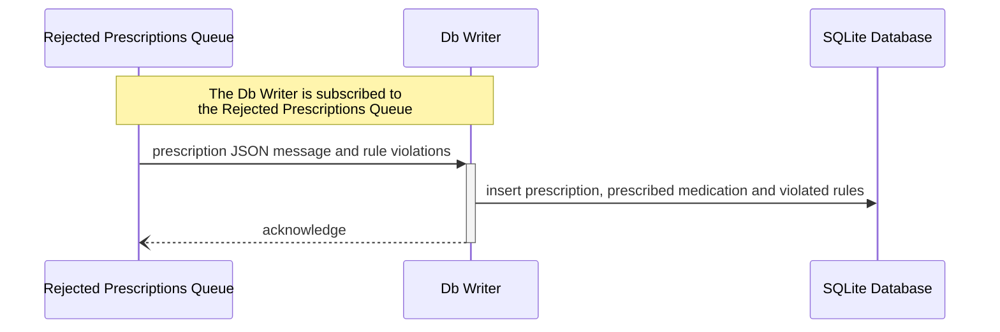

# Db Writer

Refer to the [architecture diagram](../../README.md#architecture-diagram) to understand where this application is situated in the system.

## Run the application

To run this application, run `npm install` inside the `db-writer` folder, and then run `node app.js`.

## Summary

The Db Writer is subscribed to both the [accepted_prescriptions_queue](../../infra/README.md#exchanges--queues) and the [rejected_prescriptions_queue](../../infra/README.md#exchanges--queues).\
When it consumes a message (JSON prescription) from the accepted queue, the prescription gets inserted to the database.\
When it consumes a message (JSON prescription and set of violated rules) from the rejected queue, both the prescription and the violated rules get inserted into the database. These are linked by a foreign key.

## Sequence Diagrams

### Accepted Prescriptions

### Rejected Prescriptions

