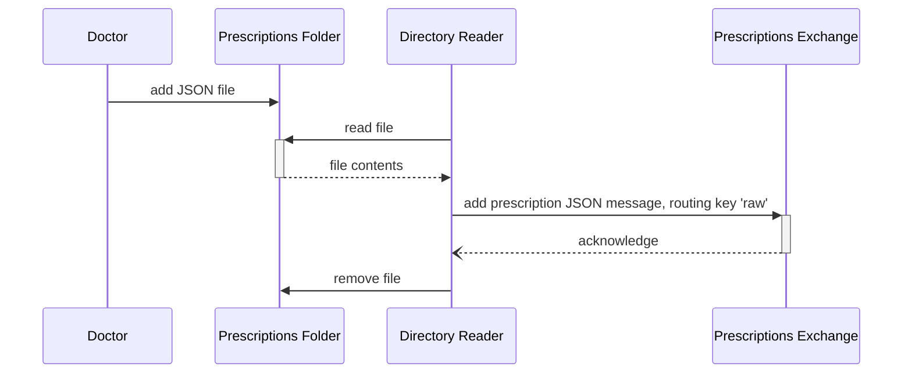
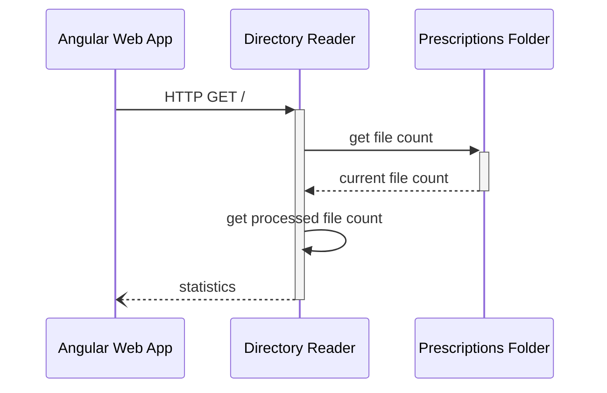

# Directory Reader

Refer to the [architecture diagram](../../README.md#architecture-diagram) to understand where this application is situated in the system.

## Run the application

To run this application, run `npm install` inside the `directory-reader` folder, and then run `node app.js`.

## Run the tests

To run the automated unit tests, run `npx jest` inside the `directory-reader` folder.

## Summary

The Directory Reader uses [Chokidar](https://www.npmjs.com/package/chokidar) to watch the prescriptions folder, and [amqplib](https://www.npmjs.com/package/amqplib) to communicate with RabbitMQ over AMQP.

When a new prescription JSON file is added, this application reads it content and sends it to the [prescriptions_exchange](../../infra/README.md#exchanges--queues) with a routing key of 'raw'.
When the exchange acknowledges that the message is received, the file gets deleted from the prescriptions folder.
Node.js' built-in HTTP server is used to expose statistics about the amount of files that have been processed by this application.

## Sequence Diagrams

### General Flow

### Exposed HTTP Server

