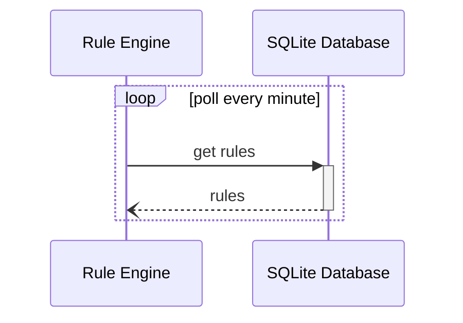
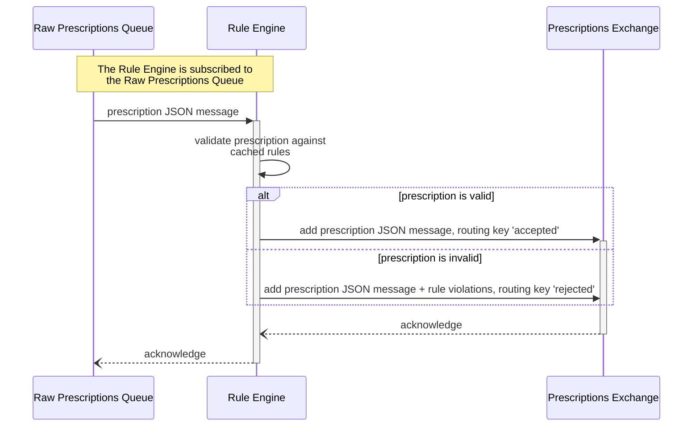

# Rule Engine

Refer to the [architecture diagram](../../README.md#architecture-diagram) to understand where this application is situated in the system.

## Run the application

To run this application, run `npm install` inside the `rule-engine` folder, and then run `node prescription-processor.js`.

## Summary

The Rule Engine uses [amqplib](https://www.npmjs.com/package/amqplib) to communicate with RabbitMQ over AMQP, [better-sqlite3](https://www.npmjs.com/package/better-sqlite3) to communicate with the database, and [moment](https://www.npmjs.com/package/moment) to parse dates.

### Rules
The Rule Engine fetches information about the order of the enabled activation rules from the database, and caches the result. To prevent the cache from getting stale, this is done every minute.

### Flow

The Rule Engine is subscribed to the [raw_prescriptions_queue](../../infra/README.md#exchanges--queues).
When it consumes a message (JSON prescription) from this queue, it validates the prescription against the cached set of rules.
Valid prescriptions are sent to the prescription_exchange with a routing key of 'accepted', whilst invalid prescriptions and their rule violations are sent to the prescription_exchange with a routing key of 'rejected'.

## Sequence Diagrams

### Rules Cache

### General Flow

