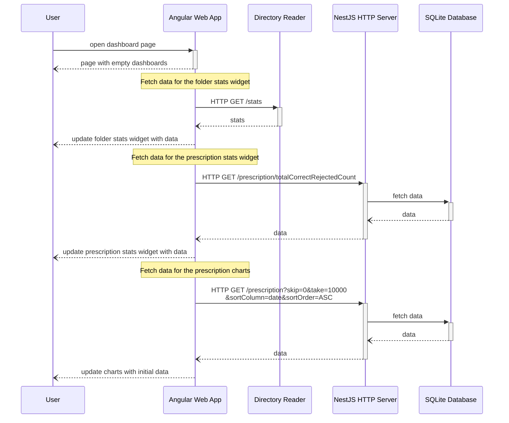
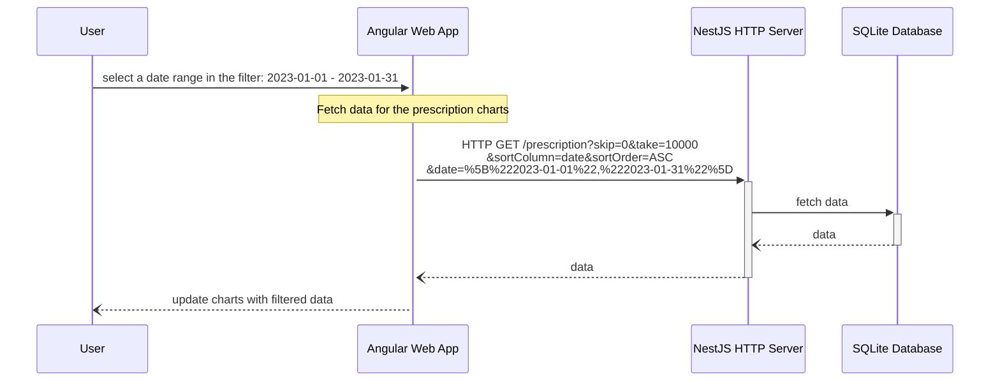
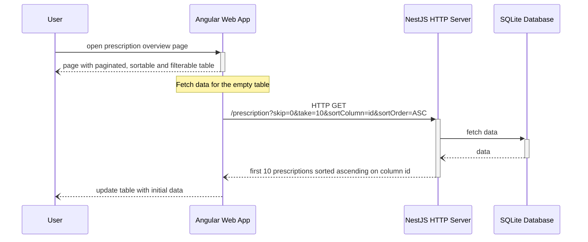
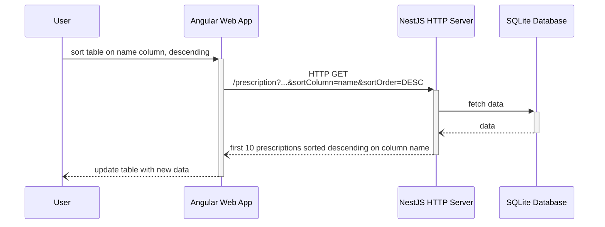
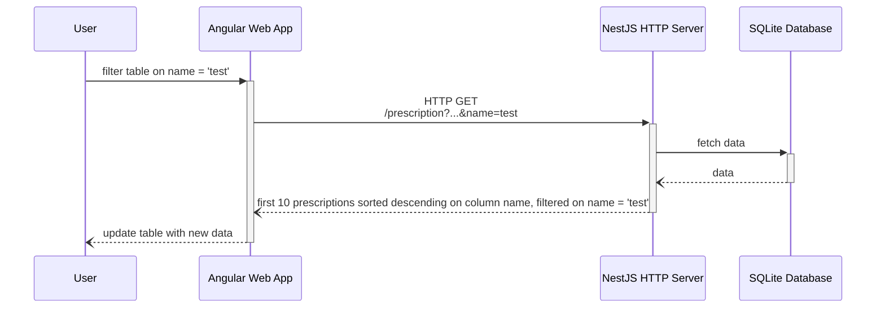
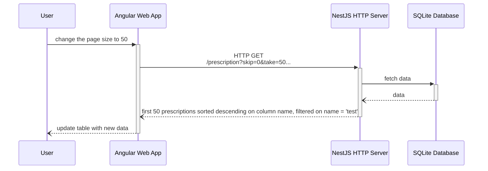
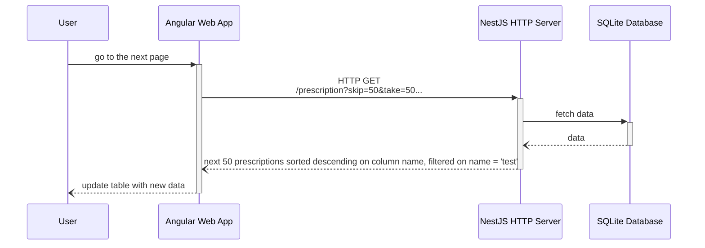
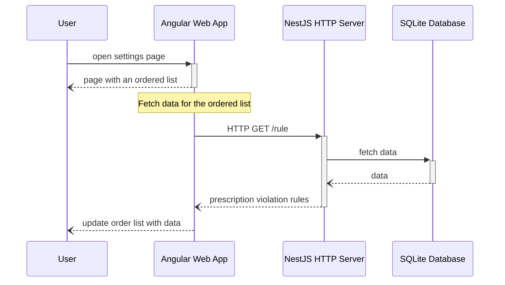
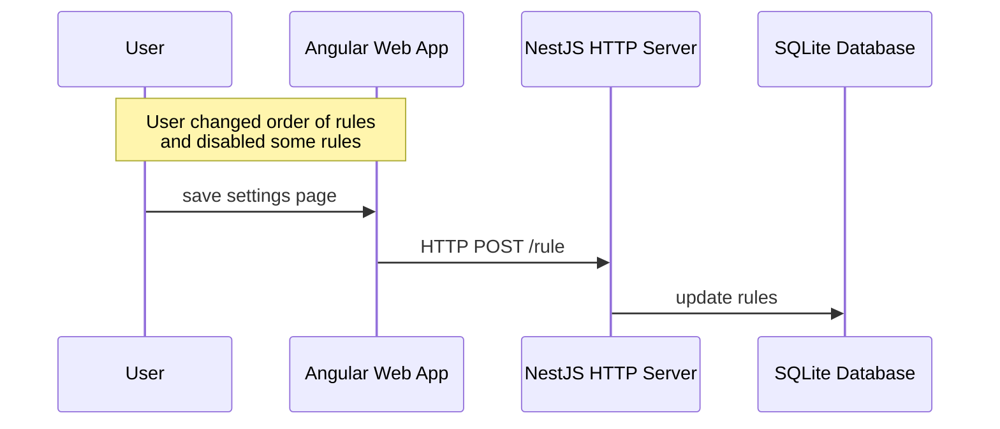

# Web App

#### Table of Contents

1. [Quickstart](#quickstart)
2. [Summary](#summary)

## Quickstart

Run `docker-compose up` inside the `vitaz/site` folder.

Navigate to http://localhost

## Summary

The web app uses [Angular](client/README.md) for the front-end, and [NestJS](server/README.md) for the back-end.

To start the front-end and the back-end, go to their respective folders and for both run the following commands sequentially:
1. `npm install`
2. `npm run start`

The Angular application starts listening on port 4200, the NestJS application on port 3000.\
To use the application, navigate to http://localhost:4200.

#### Table of Contents
1. [The dashboard page](#dashboard)
   1. [Initial Page Load](#initial-page-load)
   2. [Date Range Filter](#date-range-filter)
2. [Entity overview pages](#overview-pages)
   1. [Initial Page Load](#initial-page-load-1)
   2. [Sort](#sort)
   3. [Filter](#filter)
   4. [Change Page Size](#change-page-size)
   5. [Change Page](#change-page)
3. [The settings page](#settings)
   1. [Initial Page Load](#initial-page-load-2)
   2. [Save](#save)

## Dashboard

The dashboard page shows:
* a daterange filter
* statistics for the prescriptions folder and the [Directory Reader](../prescriptions-processor/directory-reader/README.md) application
* statistics for the prescriptions (% accepted vs rejected)
* two charts for the prescriptions

### Initial Page Load

### Date Range Filter

## Overview Pages

There are overview pages for three entities on the Angular web app: Prescription, Doctor, and Patient.\
Each page has a table which is paginated, sortable, and filterable. By default, a page has a size of 10, and is sorted ascending on the entity's first column.\
When such a page loads, the HTML for the page is served whilst an HTTP call fetches the data for the table in the background.

The following sequence diagrams show the flow for the Prescription entity, but it is the same for the other entities.

### Initial Page Load

### Sort

### Filter

### Change Page Size

### Change Page

## Settings
On the settings page a user can:
* change the order of prescription validation rules by drag&drop
* enable/disable specific rules

Both actions affect the [Rule Engine](../prescriptions-processor/rule-engine/README.md) application.

## Initial Page Load

## Save

